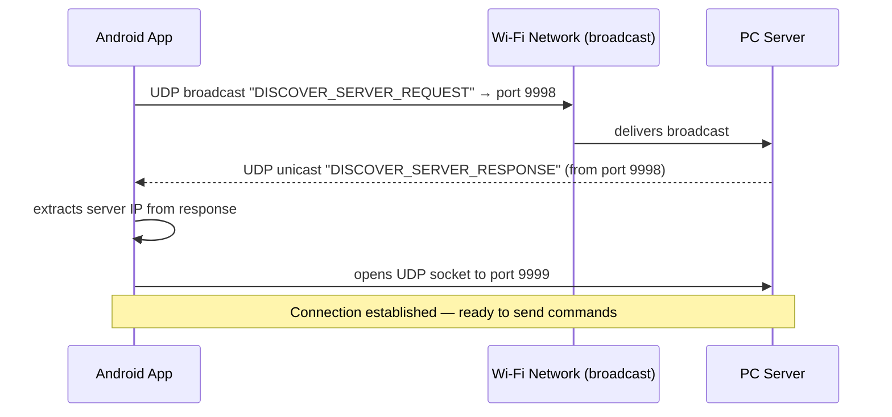
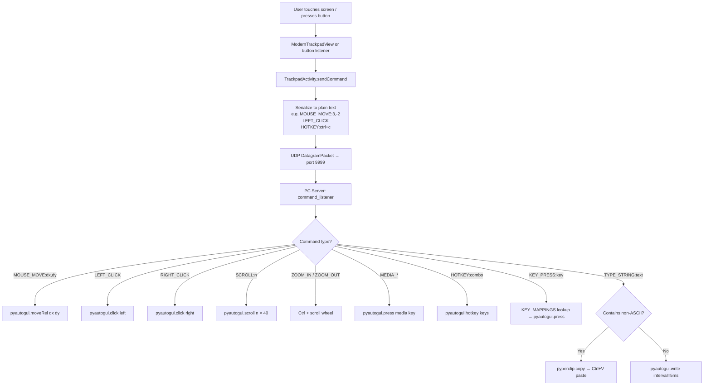
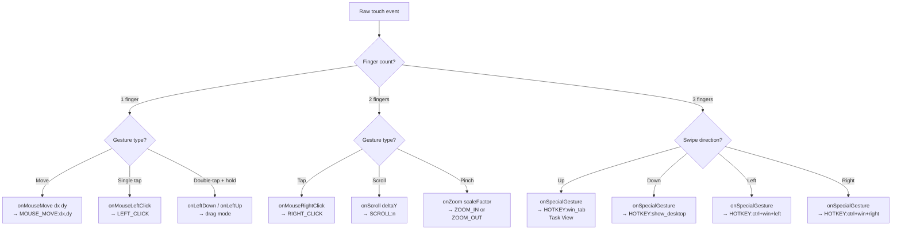

# Mousedroid

**Turn your Android phone into a wireless trackpad and remote control for your PC.**

No USB cable, no Bluetooth pairing — just connect to the same Wi-Fi network and you're ready to go.

---

## What it does

Mousedroid has two parts:

- **Android app** (Kotlin) — captures touch gestures, button presses, and keyboard input
- **PC server** (Python) — receives commands over UDP and executes them using `pyautogui`

They talk to each other over your local Wi-Fi network with no internet required.

---

## Features

**Trackpad**
- Tap to left-click, two-finger tap to right-click
- Double-tap and hold to drag
- Two-finger scroll with smooth momentum
- Pinch to zoom
- Three-finger swipes: Task View (↑), Desktop (↓), switch virtual desktops (←→)

**Media & Presentation Controls**
- Play/Pause, Next, Previous
- Volume up/down and mute
- Presentation: next/prev slide, fullscreen (F5), blank screen (B)

**Hotkey Deck**

| Action | Shortcut |
|---|---|
| Copy / Paste / Cut | `Ctrl+C` / `Ctrl+V` / `Ctrl+X` |
| Undo / Redo | `Ctrl+Z` / `Ctrl+Y` |
| New Tab / Close Tab | `Ctrl+T` / `Ctrl+W` |
| Screenshot | `Win+Shift+S` |
| Switch App | `Alt+Tab` |
| Task Manager | `Ctrl+Shift+Esc` |
| Lock PC | `Win+L` |

**Keyboard & Input**
- Type directly into whatever is focused on your PC
- Voice-to-text dictation (via Android speech API → `TYPE_STRING:…` command)
- One-tap clipboard transfer from phone to PC
- Full F1–F12, Home, End, Page Up/Down, Delete
- Number pad (0–9) and D-pad arrows

---

## Setup

### Requirements
- Python 3.8+ on your PC
- Android phone on the **same Wi-Fi network** as your PC

### 1. Start the PC server

```bash
cd server
pip install -r requirements.txt
python mousedroid_server.py
```

The terminal will print your PC's local IP address — note it down.

### 2. Connect from your phone

Open Mousedroid → tap **Scan Network** (auto-discovers via UDP broadcast).  
If that doesn't work → tap **Enter IP** and type the address from the terminal.

---

## How it works

### Architecture

```
┌─────────────────────────────┐        Wi-Fi (LAN)        ┌──────────────────────────────┐
│        Android App          │ ────────────────────────── │        PC Server             │
│                             │                            │                              │
│  Touch  →  ModernTrackpad   │  UDP port 9999 (commands)  │  command_listener thread     │
│  View   →  TrackpadActivity │ ─────────────────────────► │  handle_command()            │
│            sendCommand()    │                            │  pyautogui executes action   │
│                             │                            │                              │
│  MainActivity               │  UDP port 9998 (discovery) │  discovery_listener thread   │
│  findServer()               │ ────────────────────────── │  responds: DISCOVER_SERVER_  │
│                             │ ◄───────────────────────── │  RESPONSE                    │
└─────────────────────────────┘                            └──────────────────────────────┘
```

### Connection Discovery Flow



### Command Execution Flow



### Gesture Recognition Flow



### Protocol Reference

All commands are plain UTF-8 strings sent as UDP datagrams. No handshake, no ACK — fire and forget.

| Command | Example | Description |
|---|---|---|
| `MOUSE_MOVE:dx,dy` | `MOUSE_MOVE:3,-2` | Relative mouse movement |
| `LEFT_CLICK` | — | Left mouse button click |
| `RIGHT_CLICK` | — | Right mouse button click |
| `MIDDLE_CLICK` | — | Middle mouse button click |
| `LEFT_DOWN` / `LEFT_UP` | — | Drag start / end |
| `SCROLL:n` | `SCROLL:-3` | Scroll (positive = up) |
| `ZOOM_IN` / `ZOOM_OUT` | — | Ctrl + scroll |
| `MEDIA_PLAY_PAUSE` | — | Play/pause media |
| `MEDIA_NEXT` / `MEDIA_PREV` | — | Next/previous track |
| `VOLUME_UP` / `VOLUME_DOWN` / `VOLUME_MUTE` | — | Volume control |
| `KEY_PRESS:key` | `KEY_PRESS:F5` | Single key press |
| `HOTKEY:combo` | `HOTKEY:ctrl+c` | Key combination |
| `TYPE_STRING:text` | `TYPE_STRING:hello` | Type text at PC cursor |

### Ports

| Port | Protocol | Purpose |
|---|---|---|
| `9998` | UDP | Auto-discovery broadcast/response |
| `9999` | UDP | All command traffic |

### Unicode Text Input

Typing works differently depending on the characters:

```
ASCII text   →  pyautogui.write(text, interval=5ms)      [direct keystroke simulation]
Unicode text →  pyperclip.copy(text) → Ctrl+V paste      [clipboard bridge]
```

This means emojis, CJK characters, and accented letters all work correctly on the PC side.

---

## Project Structure

```
mousedroid/
├── app/
│   └── src/main/java/com/example/mousedroid/
│       ├── MainActivity.kt          # Connection screen, UDP discovery
│       ├── TrackpadActivity.kt      # All modes, sendCommand(), gesture callbacks
│       ├── ModernTrackpadView.kt    # Custom touch view, gesture recognition
│       └── HapticHelper.kt         # Haptic feedback wrapper
└── server/
    ├── mousedroid_server.py         # Discovery + command listener (2 threads)
    └── requirements.txt             # pyautogui, pyperclip
```
